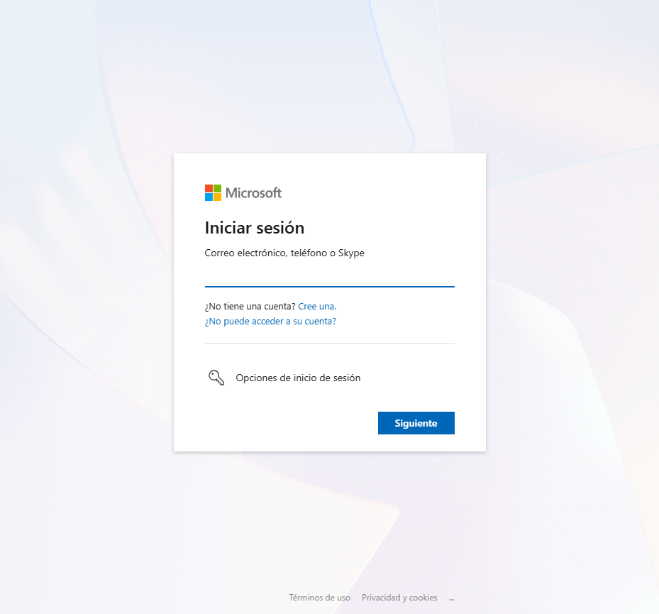
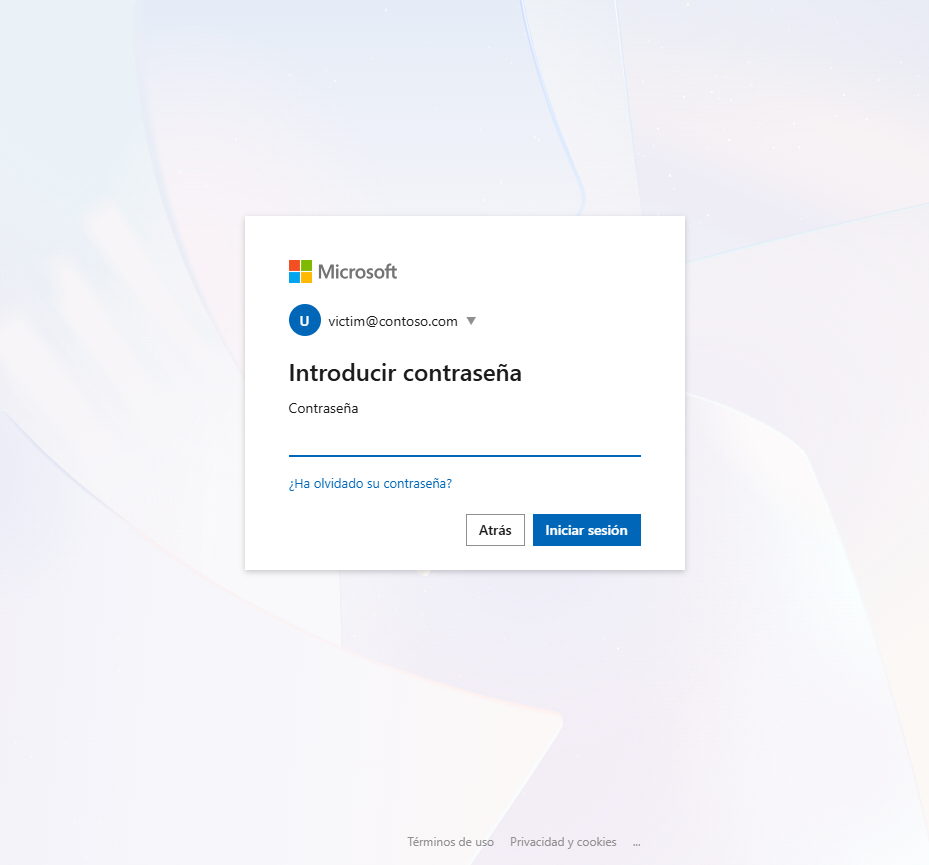

# MCP OAuth Phishing — PoC

A security research demonstration of credential phishing via VS Code's automatic MCP OAuth flow.

> **Purpose:** Authorized security research and red teaming only.

## The Attack

VS Code connects to a malicious MCP server → receives `401` → automatically executes the full OAuth 2.1 discovery + Dynamic Client Registration flow → user clicks "Allow" → browser opens to a realistic Microsoft login page → credentials are captured.

```
VS Code → Server:   POST /mcp (initialize)
Server → VS Code:   401 + WWW-Authenticate
VS Code → Server:   GET /.well-known/oauth-protected-resource
VS Code → Server:   GET /.well-known/oauth-authorization-server
VS Code → Server:   POST /register (Dynamic Client Registration)

[User clicks "Allow"]

VS Code opens browser → GET /authorize?client_id=...&redirect_uri=...
Browser shows cloned Microsoft login → [email] [password] [Sign in]
→ POST /login → credentials printed in server console
```

## Run

```bash
npm install
npm run start:test           # Start the phishing server
```

Server on `http://127.0.0.1:3000/mcp`. Connect from VS Code via `MCP: List Servers` → **Start** `testt-mcp` → **Allow** → browser opens.




## Demo

<video src="docs/images/PoC.mov" controls width="100%"></video>

## Captured Output

```
████████████████████████████████████████████████████████
█  Email:    victim@company.com
█  Password: SuperSecret123!
████████████████████████████████████████████████████████
```

## Files

| File | Purpose |
|------|---------|
| `server-test.ts` | Phishing MCP server (all endpoints in one file) |
| `server.ts` | Clean MCP server (3 tools) |
| `.vscode/mcp.json` | VS Code connection config |

## Disclaimer

For authorized security research only. Misuse is prohibited.
